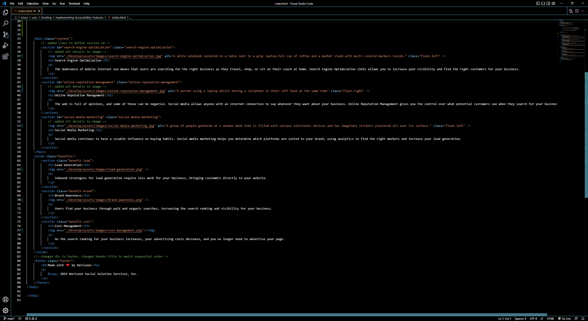
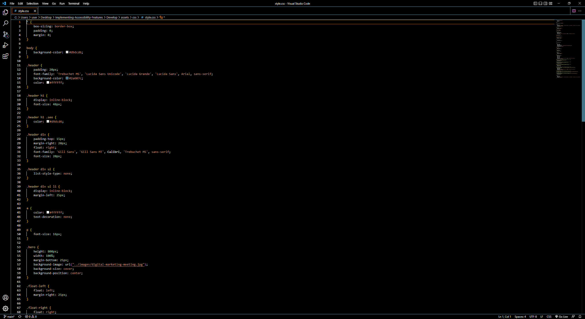
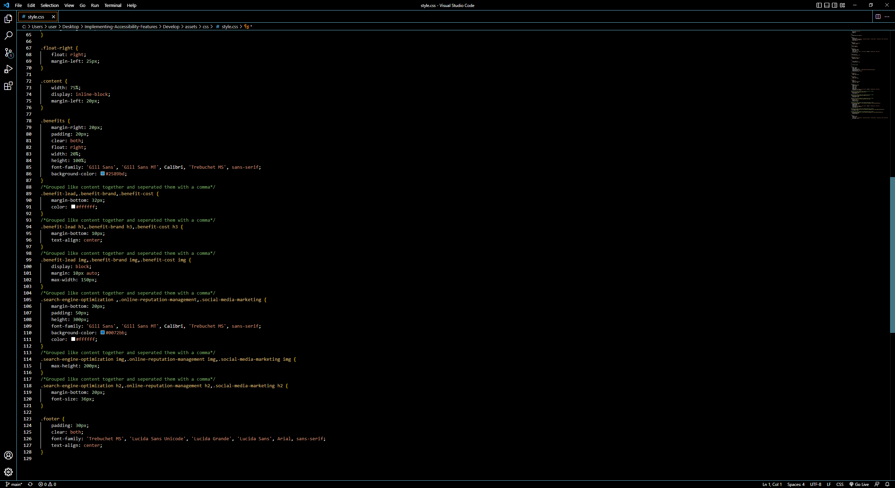

# Implementing-Accessibility-Features
This repo contains code that has been refactored to be more accessible and presentable.
Below are screenshots of the deployed website and of the HTML and Style.css files

